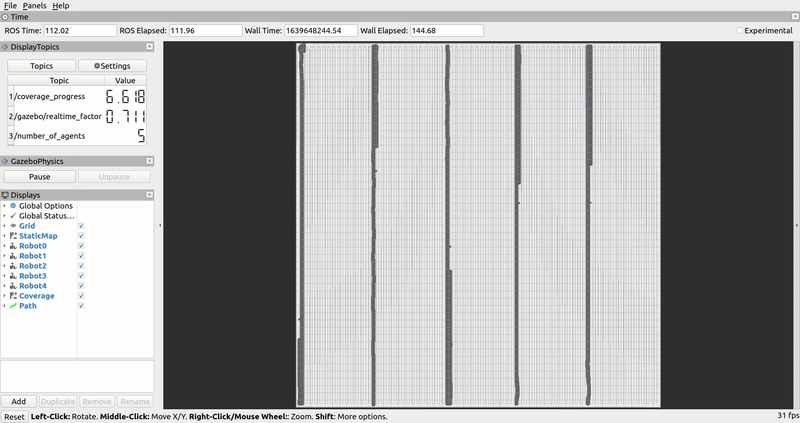
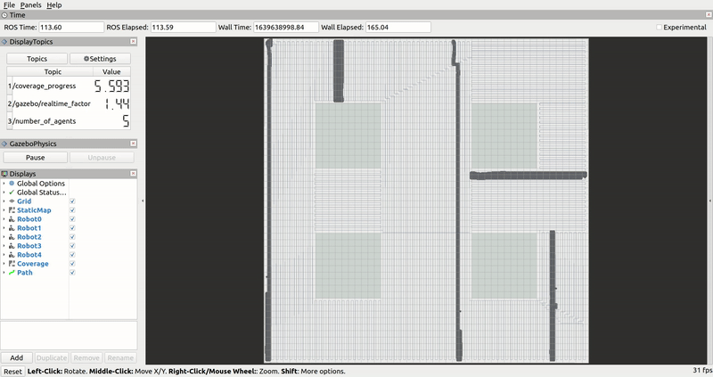
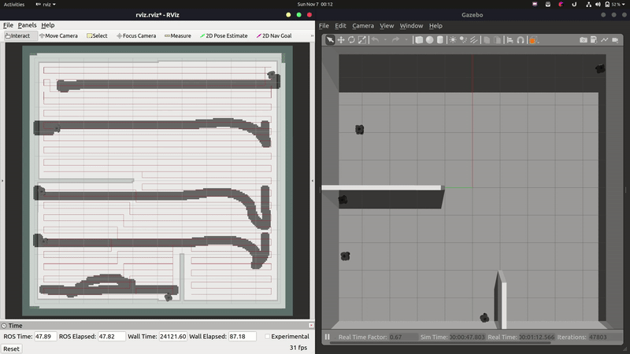
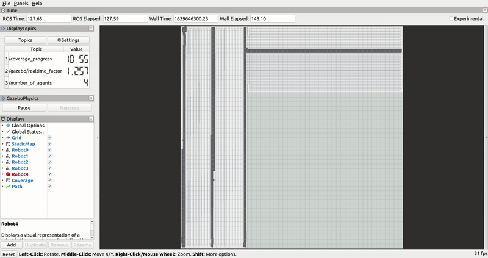

# Multi-Robot Coverage Planning

> Software stack for Cooperative Multi-Robot Coverage for Cleaning Robots.

**Developed for : AIITRA Robotics Challenge 2021 (Winner!)**

[](https://github.com/nocoinman/MRCP/actions/workflows/ros-ci.yaml)
[](https://github.com/nocoinman/MRCP/actions/workflows/lint.yaml)

Developed and Tested on **ROS Noetic + Ubuntu 20.04 + Gazebo 11**

## Features

* Solution for autonomous Multi-Robot SLAM using Frontier based exploration
* Optimizer for finding optimal number of agents required to cover an occupancy grid
* Coverage path planner based on Boustrophedon Cellular Decomposition
* PID path tracking

## Build

### Clone the project

```bash
git clone https://github.com/nocoinman/Multi-Robot-Coverage-Planning.git
cd MRCP
```

### Resolve dependencies using [`rosdep`](http://wiki.ros.org/rosdep)

```bash
rosdep install -y -i --from-paths ./src
```

### Build workspace

```bash
catkin_make --cmake-args -DCMAKE_BUILD_TYPE=Release
```

### Run the tests to make sure everything is setup correctly (optional)

```bash
catkin_make run_tests && catkin_test_results build/test_results
```

## Usage

### Shell 1

```bash
source devel/setup.bash
roslaunch simulation multi_robot.launch map:=map1
```
> Available maps: map1, map2, map3, map4

### Shell 2

```bash
source devel/setup.bash
roslaunch full_coverage_path_planner cover_map.launch map:=map1
```

### Unpause physics to start simulation

Gazebo by default starts in headless mode, with physics paused. **You'll have to unpause physics to start the simulation.**
You can do this in 2 ways.

For the shell geeks out there, you can unpause physics from the shell using `rosservice`

```bash
rosservice call /gazebo/unpause_physics
```

For the GUI fellas, we have conveniently added a custom panel to RViz to `pause` and `unpause` gazebo physics. Thanks us later!

## Workflow

Intended use of the software is as shown.


### Coverage Path Planning

Coverage path is computed using Boustrophedon Cellular Decomposition. The plan is then divided into equal sub-plans and 
assigned to each agent.

Here is a demo of the path planning algorithm in action, ran on the occupancy grid generated using Multi-Robot SLAM on a
complex office setting.

| |  |
|:--------------------------------:|:-----------------------------------------:|

### Path Tracking

Agents follow the designated path asynchronously. This is accomplished using simple PID control based path tracking.

| |  |
|:--------------------:|:---------------------:|
| |  |


## Acknowledgements

The following open-source projects were really insightful for the implementation of this project. These were improvised and adapted for our use case. Please check them out!

### [topics_rviz_plugin](https://gitlab.com/InstitutMaupertuis/topics_rviz_plugin)
### [full_coverage_path_planner](https://github.com/MapaRobo/full_coverage_path_planner)
### [tracking_pid](https://github.com/nobleo/tracking_pid)

---

The following research papers and articles were referred during ideation and development.

```bibtex
@article{DBLP:journals/corr/abs-1806-03581,
  author    = {Anirudh Topiwala and
               Pranav Inani and
               Abhishek Kathpal},
  title     = {Frontier Based Exploration for Autonomous Robot},
  journal   = {CoRR},
  volume    = {abs/1806.03581},
  year      = {2018},
  url       = {http://arxiv.org/abs/1806.03581},
  eprinttype = {arXiv},
  eprint    = {1806.03581},
  timestamp = {Mon, 13 Aug 2018 16:46:39 +0200},
  biburl    = {https://dblp.org/rec/journals/corr/abs-1806-03581.bib},
  bibsource = {dblp computer science bibliography, https://dblp.org}
}

@InProceedings{10.1007/978-1-4471-1273-0_32,
    author="Choset, Howie
    and Pignon, Philippe",
    editor="Zelinsky, Alexander",
    title="Coverage Path Planning: The Boustrophedon Cellular Decomposition",
    booktitle="Field and Service Robotics",
    year="1998",
    publisher="Springer London",
    address="London",
    pages="203--209",
    abstract="Coverage path planning is the determination of a path that a robot must take in order to pass over each point in an environment. Applications include vacuuming, floor scrubbing, and inspection. We developed the boustrophedon cellular decomposition, which is an exact cellular decomposition approach, for the purposes of coverage. Each cell in the boustrophedon is covered with simple back and forth motions. Once each cell is covered, then the entire environment is covered. Therefore, coverage is reduced to finding an exhaustive path through a graph which represents the adjacency relationships of the cells in the boustrophedon decomposition. This approach is provably complete and Experiments on a mobile robot validate this approach.",
    isbn="978-1-4471-1273-0"
}
```
