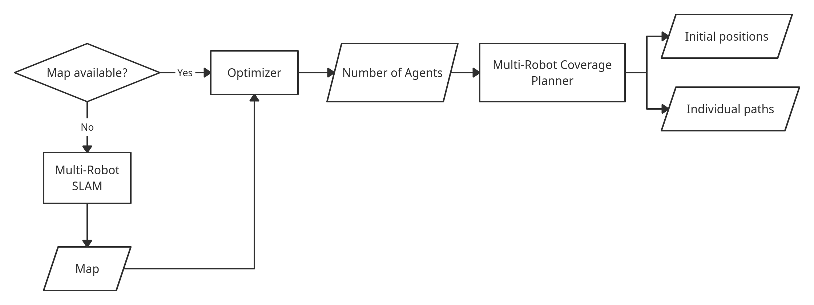
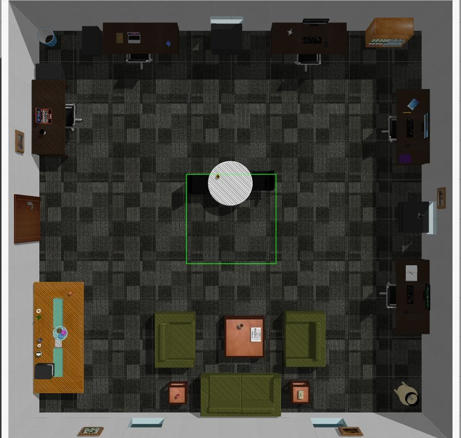
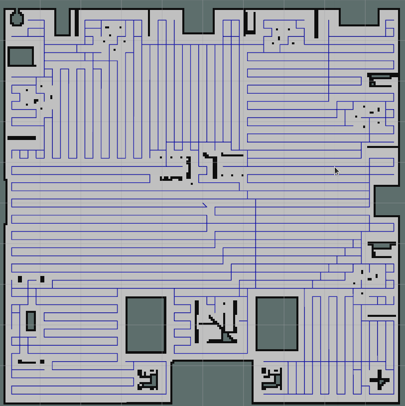

# Multi-Robot Coverage Planning

> Software stack for Cooperative Multi-Robot Coverage for Cleaning Robots.

**Developed for : AIITRA Robotics Challenge 2021**

[](https://github.com/nocoinman/MRCP/actions/workflows/ros-ci.yaml)
[](https://github.com/nocoinman/MRCP/actions/workflows/lint.yaml)

Developed and Tested on **ROS Noetic + Ubuntu 20.04 + Gazebo 11**

## Features

* Solution for autonomous Multi-Robot SLAM using Frontier based exploration
* Optimizer for finding optimal number of agents required to cover an occupancy grid
* Coverage path planner based on Boustrophedon Cellular Decomposition
* PID path tracking

## Resolving Dependencies

```bash
sudo rosdep install -i -y --from-paths ./src 
```

## Usage

*NOTE: Gazebo physics engine in a multi-robot simulation setting is really CPU intensive.*

### Multi-Robot Coverage

```bash
roslaunch simulation multi_robot.launch map:=map2_small
roslaunch full_coverage_path_planner cover_map.launch map:=map2_small
```

NOTE: **Make sure to unpause physics!**

### Multi-Robot SLAM

```bash
# todo(ashwin)
```

## Workflow

Intended use of the software is as shown.



### Coverage Path Planning

Coverage path is computed using Boustrophedon Cellular Decomposition. The plan is then divided into equal sub-plans and 
assigned to each agent.

Here is a demo of the path planning algorithm in action, ran on the occupancy grid generated using Multi-Robot SLAM on a
complex office setting.

| |  |
|:--------------------------------:|:-----------------------------------------:|

### Path Tracking

Agents follow the designated path asynchronously. This is accomplished using simple PID control based path tracking.

## Citation

```bibtex
@article{DBLP:journals/corr/abs-1806-03581,
  author    = {Anirudh Topiwala and
               Pranav Inani and
               Abhishek Kathpal},
  title     = {Frontier Based Exploration for Autonomous Robot},
  journal   = {CoRR},
  volume    = {abs/1806.03581},
  year      = {2018},
  url       = {http://arxiv.org/abs/1806.03581},
  eprinttype = {arXiv},
  eprint    = {1806.03581},
  timestamp = {Mon, 13 Aug 2018 16:46:39 +0200},
  biburl    = {https://dblp.org/rec/journals/corr/abs-1806-03581.bib},
  bibsource = {dblp computer science bibliography, https://dblp.org}
}

@InProceedings{10.1007/978-1-4471-1273-0_32,
    author="Choset, Howie
    and Pignon, Philippe",
    editor="Zelinsky, Alexander",
    title="Coverage Path Planning: The Boustrophedon Cellular Decomposition",
    booktitle="Field and Service Robotics",
    year="1998",
    publisher="Springer London",
    address="London",
    pages="203--209",
    abstract="Coverage path planning is the determination of a path that a robot must take in order to pass over each point in an environment. Applications include vacuuming, floor scrubbing, and inspection. We developed the boustrophedon cellular decomposition, which is an exact cellular decomposition approach, for the purposes of coverage. Each cell in the boustrophedon is covered with simple back and forth motions. Once each cell is covered, then the entire environment is covered. Therefore, coverage is reduced to finding an exhaustive path through a graph which represents the adjacency relationships of the cells in the boustrophedon decomposition. This approach is provably complete and Experiments on a mobile robot validate this approach.",
    isbn="978-1-4471-1273-0"
}
```
